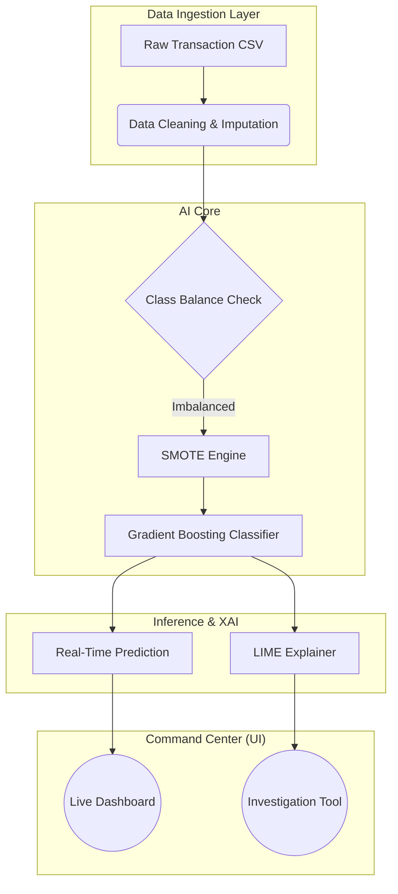

# 🛡️ Fraud Detection Command Center
### *Real-Time Financial Surveillance & Explainable AI System*


> **"Black box models are a liability in Finance. We built a glass box."**

The **Fraud Detection Command Center** is a state-of-the-art anomaly detection system designed to monitor high-velocity banking transactions. It fuses the predictive power of **Gradient Boosting** with the transparency of **LIME (Local Interpretable Model-agnostic Explanations)**, allowing investigators to not only detect fraud in real-time but understand the *root cause* behind every alert.

---

## ⚡ System Capabilities

| Feature | Description |
| :--- | :--- |
| **🚨 Live Telemetry** | Simulates a high-frequency transaction stream, detecting anomalies in milliseconds. |
| **⚖️ Auto-Balancing** | Implements **SMOTE** (Synthetic Minority Over-sampling Technique) to conquer dataset imbalance, ensuring rare fraud cases aren't ignored. |
| **🧠 Explainable AI** | Integrated **LIME engine** allows analysts to autopsy any transaction and see exactly which features drove the risk score. |
| **🔬 Forensic Sandbox** | A dedicated investigation environment to stress-test the model with hypothetical transaction scenarios. |

---

## 🏗️ Technical Architecture

This application runs on a streamlined, single-file architecture optimized for rapid prototyping and deployment.



---

## 🖥️ The Dashboard Experience

### 1. The Watchtower (Live Monitoring)
The left panel acts as a dedicated Watchtower. It processes the dataset in an infinite loop, simulating live banking traffic.
*   **Real-time Ticker:** Tracks total volume and fraud intercepts.
*   **Alert Log:** A rolling feed of flagged transactions with high-confidence risk scores.

### 2. The Lab (Forensic Investigation)
The right panel is the Analyst's Lab. Here, we peel back the layers of the neural logic.
*   **Scenario Testing:** Manually input values for features like `daily_decr30` (Daily Decrement) or `rental30`.
*   **Risk Autopsy:** The system generates a visual breakdown:
    *   🔴 **Risk Accelerators:** Features pushing the transaction toward "Fraud".
    *   🟢 **Trust Signals:** Features proving legitimacy.

---

## 🛠️ Quick Start

### Prerequisites
*   Python 3.8+
*   A dataset named `bank_fraud_dataset.csv` in the root directory.

### Installation

```bash
# 1. Clone the repository
git clone https://github.com/yourusername/fraud-command-center.git
cd fraud-command-center

# 2. Install the heavy-lifting libraries
pip install -r requirements.txt

# 3. Launch the Command Center
streamlit run app.py
```

---

## 🧠 The AI Stack

We chose a specific stack to maximize **Precision** and **Recall** while maintaining interpretability.

*   **Model:** `GradientBoostingClassifier` (Scikit-Learn). Chosen for its ability to handle non-linear relationships in tabular financial data better than standard Logistic Regression.
*   **Preprocessing:** `StandardScaler` for normalization and `SimpleImputer` (Median) for handling missing financial records.
*   **XAI:** `lime_tabular`. Financial regulations (like GDPR) often require a "Right to Explanation." LIME provides local fidelity, explaining individual predictions rather than just global model trends.

---

## 📂 Project Structure

```text
fraud-command-center/
├── app.py                 # 🧠 The Brain: UI, Training, and Inference logic in one
├── requirements.txt       # 📦 Dependencies (Streamlit, LIME, Sklearn, Imblearn)
├── bank_fraud_dataset.csv # 💾 The Data: Historical transaction records
└── README.md              # 📄 Documentation
```

---

## 🔮 Future Roadmap

*   [ ] **Dockerization:** Containerize for Kubernetes deployment.
*   [ ] **Drift Detection:** Alert when live data distribution diverges from training data.
*   [ ] **Database Hook:** Replace CSV simulation with PostgreSQL/Snowflake connection.
*   [ ] **Deep Learning:** Experiment with Autoencoders for unsupervised anomaly detection.

---

<div align="center">

**Built for Transparency. Engineered for Security.**

[Report Bug](https://github.com/yourusername/fraud-command-center/issues) • [Request Feature](https://github.com/yourusername/fraud-command-center/issues)

</div>
